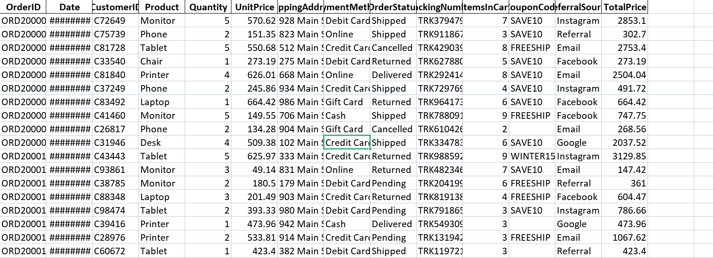
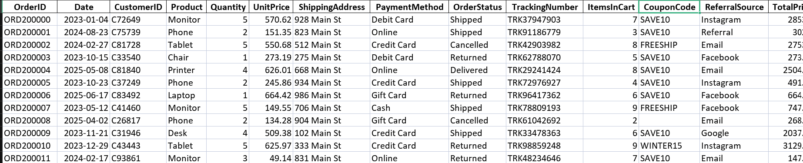
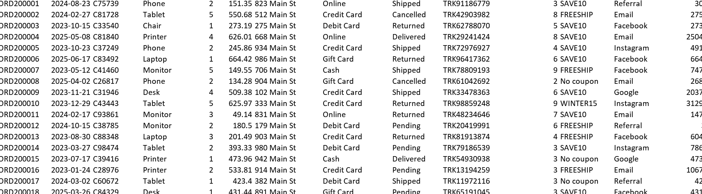
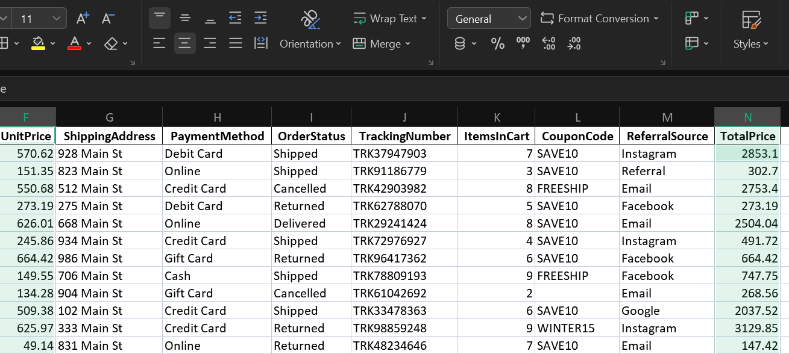
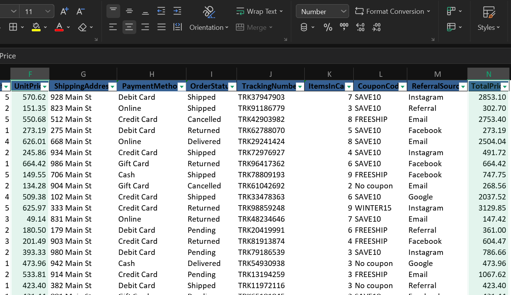
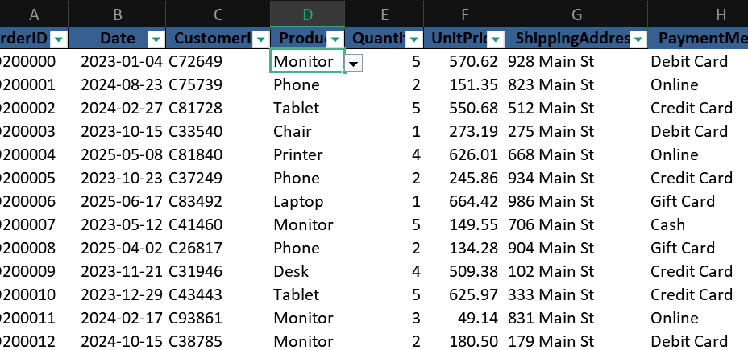

Week 1 - Data Cleaning and Preparation 
**Transforming Raw Noise into Business Intelligence**

TASK:
Using Excel, take a raw, messy, unfiltered and unverified dataset of office equipment sales, transform it and make it ready for analysis. Transformation is done by handling missing values, duplicates, and incorrect data.

Key Requirements:
1. Identify missing or null values
2. Remove duplicates
3. Correct Data formats

Understanding the Dataset:
Source: Decode Labs
Raw Size: 1200 rows, 14 columns
Tool used: Excel

Data Cleaning Process
1. There are a total of 1200 rows of data, less than a million, making excel the ideal tool for this task.

2. The dataset is generally clean with minimal issues.

3. Inconsistencies: I reviewed the entire dataset for any inconsistencies. There were none. However, rows and columns were clustered making the data hard to read. I Resized rows and columns to fit the information. 

4. Duplicate Records: None found

5. Incomplete Records: The "CouponCode" field had 309 null fields. In order to make the information attributable, all null fields were replaced with "No Coupon"

Before

After

6. Standardize Formats/Data Types
    Converted "Date" format to "yyyy-mm-dd"
    Converted "UnitPrice" and "TotalPrice" from General format to Number format with 2 decimal places.

    Before
    

    After
    

7. Structual Validation
Numerical Range validation:
Columns affected - Quantity, ItemsInCart. These were set to accept only values from 1 and above, nothing less than 1. 

Categorical Validation:
Columns affected - Product, PaymentMethod and OrderStatus. 

Products - This was set to accept only values from a list of 7 items available for sale (Chair, Desk, Laptop, Monitor, Phone, Printer and Tablet). The product listing can be updated when there are additional items, by adding the item to the sheet labelled "Validations"

OrderStatus - Set to accept only from the 5 possible items in the "OrderStatus" column in the sheet labelled "Validations". This can also be updated when there are more possible items.

PaymentMethods - Set to accept any one of the possible items from the "PaymentMethods" column in the "Validations" sheet.

