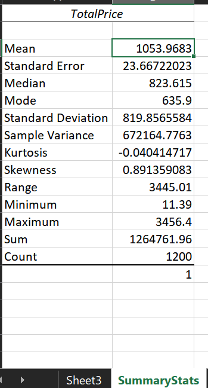
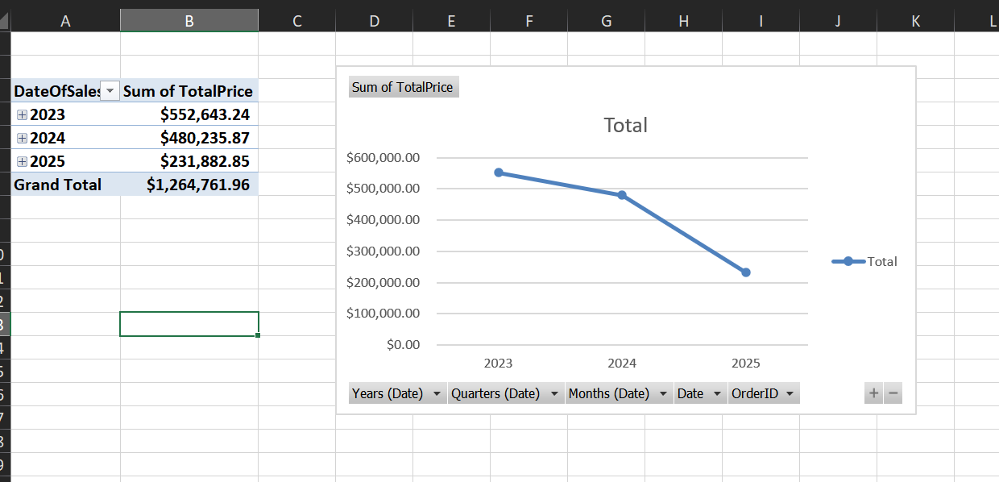
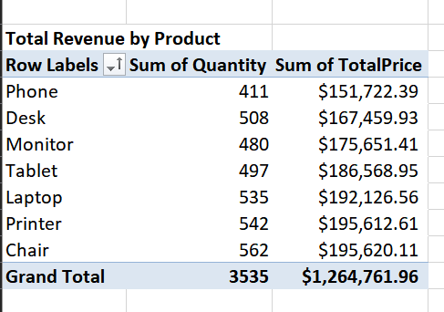
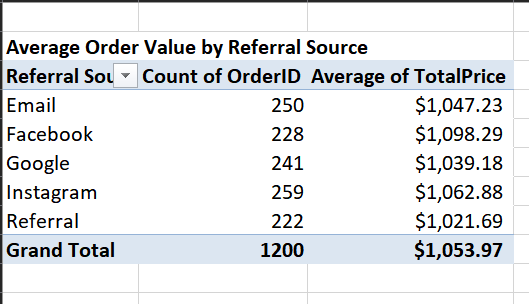
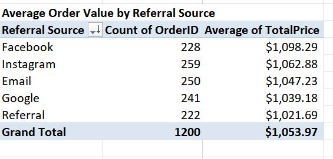
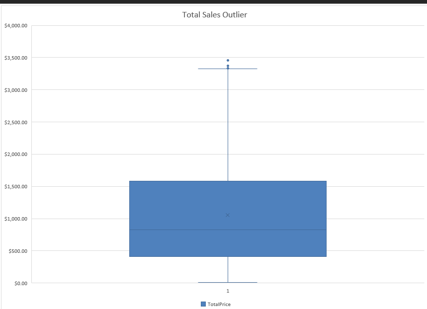
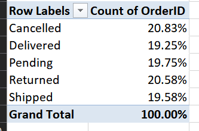
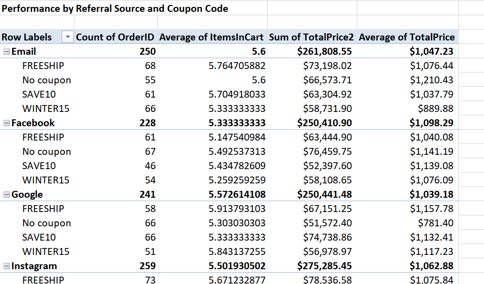
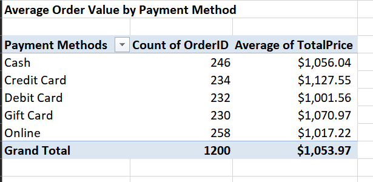

Week 2 - Exploratory Data Analysis (EDA)
**Uncover the Story in the Data - Turn raw information into absolute clarity**

Task
Using Excel, Analyze a dataset to understand patterns, trends, and distributions.

Key Requirements:
1. Calculate basic statistics (mean, median, count)
2. Identify trends and outliers
3. Additional Insight
4. Summarize key Insights & Observations

Goal: Data analysis, descriptive statistics, analytical thinking

Understanding the Dataset:
Source - Decode Labs
Raw Size - 1200 rows, 14 columns
Tool used - Excel

1. Basic Statistics
To explore my data and get a baseline, I started off with an overview. For this I used the 'Descriptive Statistics" option in Excel to get the Basic statistics such as Mean, Median and Count.

From what I have gathered, the "Mean is 1053.9683" while the "Median value is 823.615". There is a variation of more than 70% between the Mean and the Median, indicative of a skewed revenue distribution caused by some high value orders. As we go deeper into the data, we should be able to confirm if this is the case or not.

2. Identify Trends and Outliers

Starting with Trends and using a Pivot Table, I will be checking some high-level KPIs such as 
        Total Revenue (Sum of TotalPrice)
        Total Quantity of Products sold
        Average Order Value by Referral Source

The first is a Line chart showing us the total revenue trend grouped by dates - days, months, quarters, and years.

Total Quantity of Products sold
To understand which products performed best, I grouped sales by Product and Quantity in ascending order. 

Average Order Value by Referral Source
This is to help us understand which channel brings in the highest volume of customers and which brings the highest spending customers. I sumarized order count and average of TotalPrice by Referral source. The margins between all the referral sources is minimal. However, arranging everything in descending order of average Total price, paints a clearer picture.

Outliers

To check for Outliers, I created a plot graph to show the distribution. There is clearly an outlier in the TotalSalesPrice, the isolated [$3,456] is well above the average sales value.

I summarized orders according to their status i.e. cancelled, delivered, etc. The order statuses with the highest percentages are "cancelled" and "returned" while the lowest number sits in "delivered" orders. This is indicative of operational issues causing orders to be cancelled or returned.

3. Additional Insights

Order Value Grouped by Referral Source and Coupon Code
This grouping allows us to see customers who buy because of discounts, coupon code performance etc

Average Order Value by payment method
I grouped average order value by each payment method. This shows which payment method accounts for more sales. 

4. Summarize Key Insights and Observations

a. Overall Sales Performance
The anaysis showed that the highest performing product by TotalSalesPrice (Revenue), 

